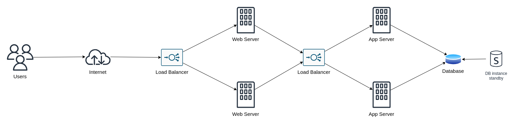
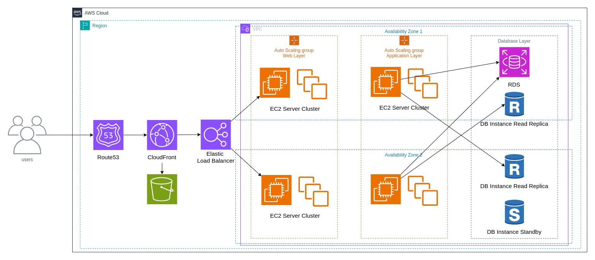

# Designing application migration to the cloud

When migrating applications to the cloud, the design phase is crucial to ensure that your application not only moves successfully but also functions optimally in its new environment. The primary goal during this phase is to make sure your application architecture meets the success criteria defined for the migration.

For example, if your on-premises application maintains user sessions on an application server to enable horizontal scaling, you must implement a similar approach in the cloud. This ensures that your application can continue to scale effectively after migration.

To begin, you need a thorough understanding of your organization's existing architecture, both on-premises and in the cloud. This includes:

- User accounts
- Network configuration and connectivity
- Security measures
- Governance policies
- Monitoring systems

With this knowledge, you can design and maintain a new architecture tailored to your application's needs. If your application handles sensitive data, such as Personally Identifiable Information (PII), your cloud architecture must include specific network settings to ensure compliance with regulations.

During the design phase, you'll identify gaps in your current architecture and make necessary enhancements to meet your application's requirements. For organizations with multiple AWS accounts, it's important to consider relationships and dependencies between these accounts. For instance, you might have a dedicated security account to ensure compliance across all resources.

When designing your application's network architecture, consider the following:

- How network traffic flows in and out of your application
- Routing for both external and internal traffic
- Firewall rules for protection
- Isolation of the application from the internet and other internal systems
- Compliance and governance of the network
- Network logging and auditing
- Separation of risk levels within the application based on data exposure
- Protection against DDoS attacks
- Different network requirements for production and non-production environments
- Access needs for SaaS-based multi-tenancy applications
- Network boundaries at the business unit level
- Billing considerations and the implementation of a shared services model across units

Hybrid connectivity options with on-premises systems may also be necessary, depending on your specific requirements. To ensure a secure, reliable, and cost-effective cloud architecture, you should apply best practices throughout the design phase.

The design phase is not just about migrating the application; it's also about optimizing it to leverage the benefits of the cloud. This includes improving proximity to end-users, enhancing security, addressing data residency concerns, and building a scalable architecture that can support future growth without compromising performance.

For stateful applications, consider making some components stateless to improve scalability. For any stateful components, techniques like session affinity can help maintain scalability. If your application processes large amounts of data, adopting a distributed processing approach can be beneficial.

To reduce operational complexity and costs, consider using serverless architectures. These can eliminate the need to manage underutilized servers or redundant infrastructure while still providing high availability.

In your cloud migration strategy, for example, you might rehost web servers and introduce auto-scaling to handle spikes in demand. Elastic load balancers can distribute incoming traffic, and refactoring application servers or moving the database tier to Amazon RDS can provide a more cloud-native solution. Distributing the architecture across multiple availability zones ensures high availability, with databases replicating to standby instances in a secondary availability zone.

As the final output of the design phase, create a detailed design document for each application. This should include specifics like user accounts, network configurations, and access requirements. This document will serve as a crucial reference during the migration validation phase to ensure both cloud functionality and application performance are up to standard.
