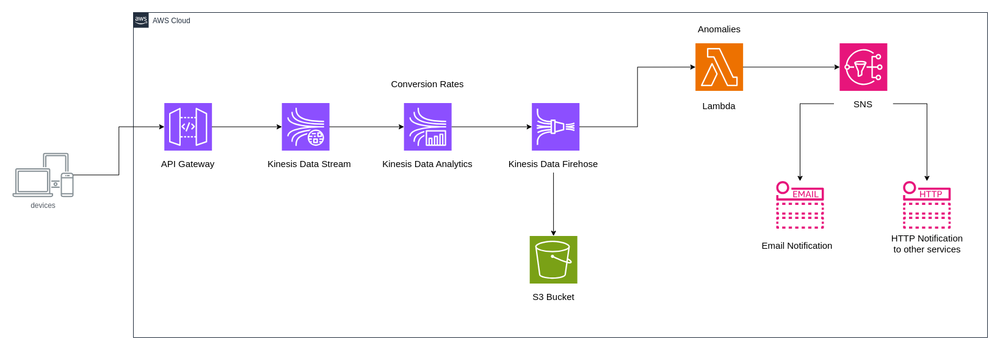

# Event stream model

In an event stream model, the consumer continuously reads a flow of events generated by the producer. This model is particularly useful for scenarios where real-time data processing and analysis are crucial. For example, imagine capturing a continuous stream of user interactions, such as clickstream logs, from an e-commerce website. If any anomalies are detected, an alert can be sent immediately.

## Event Stream Model Overview

**Amazon Kinesis** is a powerful service designed to ingest, process, and store continuous streams of data. Consider an e-commerce application where users interact with web and mobile platforms, generating a constant stream of click events. These clickstreams are invaluable for understanding user behavior and can be analyzed in real-time to drive business decisions.

### How It Works

1. **Data Ingestion via Amazon Kinesis:**
   - As users interact with the e-commerce application, each click generates an event that is captured and sent to Amazon Kinesis. Kinesis efficiently ingests this high-volume data, ensuring it is immediately available for processing.

2. **Real-Time Analytics:**
   - The clickstream data is then processed by an analytics application using Amazon API Gateway. Within this application, **Kinesis Data Analytics** is employed to calculate key metrics, such as Conversion Rates, over specified time intervals. For instance, it can track the number of users who made a purchase within the last five minutes.

3. **Data Storage with Amazon Kinesis Data Firehose:**
   - After the data is aggregated and analyzed in real-time, the results are sent to **Amazon Kinesis Data Firehose**. This service handles the reliable delivery of streaming data to long-term storage solutions, such as Amazon S3. By storing these data files in S3, the information is preserved for further analysis or historical reporting.

4. **Anomaly Detection with AWS Lambda:**
   - A **Lambda function** is set up to read from the event stream and monitor the data for any anomalies. For example, if there is an unexpected drop or spike in conversion rates, the Lambda function detects this and triggers an alert. The campaign team is then notified via email, allowing them to quickly respond to potential issues.

### Architectural Benefits

This architecture, based on the event stream model, allows for continuous data processing and immediate reaction to critical events. The producer (in this case, the e-commerce application) and the consumer (analytics application, storage, and alerting systems) are decoupled, ensuring that each component operates independently. This decoupling also makes the architecture highly scalable and flexible—new consumers can be integrated into the system at any time without disrupting the existing flow of data.

Additionally, by leveraging event-driven architecture, this system supports a distributed model where each subsystem has an independent view of the events. This ensures that the system is robust, scalable, and capable of handling large volumes of data efficiently.

### Considerations

While this architecture is powerful, there are some important considerations to keep in mind:

- **Duplicate Processing:** Implement mechanisms to avoid processing the same event more than once, which can lead to inconsistencies in your data.
- **Error Handling:** Ensure that your system can gracefully handle errors, such as network issues or data processing failures, to maintain overall system reliability.

### The Role of Caching

To further enhance performance, caching can be applied at various layers of the architecture. Caching helps reduce latency and improves the speed of data retrieval, ensuring that your application remains responsive even under heavy loads.

By adopting the event stream model with Amazon Kinesis and integrating real-time analytics, anomaly detection, and scalable data storage, you can build a highly responsive and efficient system that meets the demands of modern, data-driven applications.
