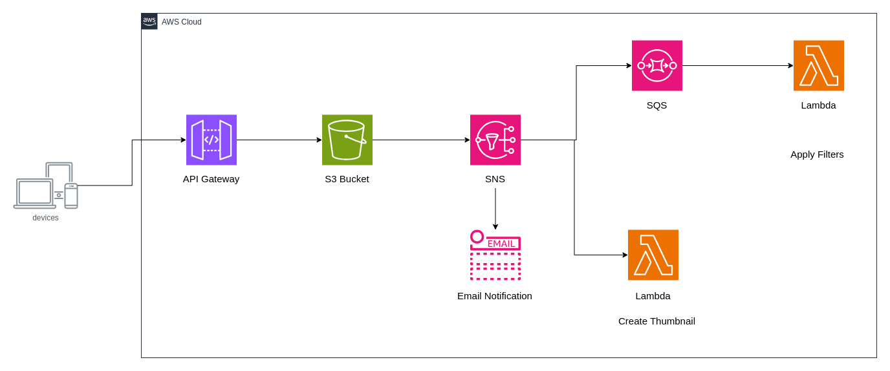

# Publisher subscriber model

In the publisher/subscriber (pub/sub) model, when an event occurs, a notification is sent to all subscribers, who then process the data according to their specific requirements. This model is particularly effective for systems that need to perform multiple, independent actions in response to a single event.

Let’s illustrate this with an example of a photo studio application that enhances photos with various filters and notifies the user once processing is complete.

## How the System Works

1. **User Uploads Photo:**
   - The process begins when a user uploads a photo via a web or mobile application. The image is stored in an Amazon S3 bucket, which acts as the central storage for the application.

2. **Amazon S3 Triggers a Notification:**
   - Once the photo is successfully uploaded, Amazon S3 triggers a notification to Amazon Simple Notification Service (SNS). This SNS topic serves as the central hub for distributing messages to all relevant subscribers.

3. **Distribution to Subscribers:**
   - **Email Notification to User:**
     - The first subscriber to the SNS topic is an email service. As soon as the upload is complete, an email is automatically sent to the user, confirming that their photo has been successfully uploaded and is being processed.
   - **Image Processing via Amazon SQS:**
     - The second subscriber is an Amazon SQS queue, which receives the message from the SNS topic. The message in the SQS queue triggers a series of tasks in an AWS Lambda function. This function applies various filters to enhance the image quality, ensuring that the photo meets the studio's standards before any further processing.
   - **Thumbnail Creation via AWS Lambda:**
     - The third subscriber is a direct AWS Lambda function, which immediately creates a thumbnail version of the uploaded image. This thumbnail can be used for previews, galleries, or other user-facing features within the application.

### Architectural Flow

In this architecture, Amazon S3 acts as the publisher, sending out a message to the SNS topic once a photo is uploaded. The SNS topic, in turn, serves as a distribution point, delivering notifications to all subscribed services. This allows each component—whether it’s sending an email, enhancing the photo, or creating a thumbnail—to operate independently yet cohesively within the system.

Additionally, when the message is received by Amazon SQS, it automatically triggers the AWS Lambda function, which processes the image. This setup ensures that the system is not only scalable but also resilient, as each subscriber can process the event at their own pace without relying on other services.

### Benefits of This Architecture

- **Scalability:** The pub/sub model allows the system to scale efficiently, handling numerous tasks in parallel without performance bottlenecks.
- **Loose Coupling:** Each component of the system is loosely coupled, meaning they operate independently. This makes the system more robust and easier to maintain.
- **Real-Time Processing:** Events are processed in real-time, ensuring quick turnaround for the user, whether it’s enhancing the photo or sending a notification.

This architecture exemplifies how the pub/sub model can be leveraged to create a responsive, efficient, and scalable system that meets the demands of modern applications.
