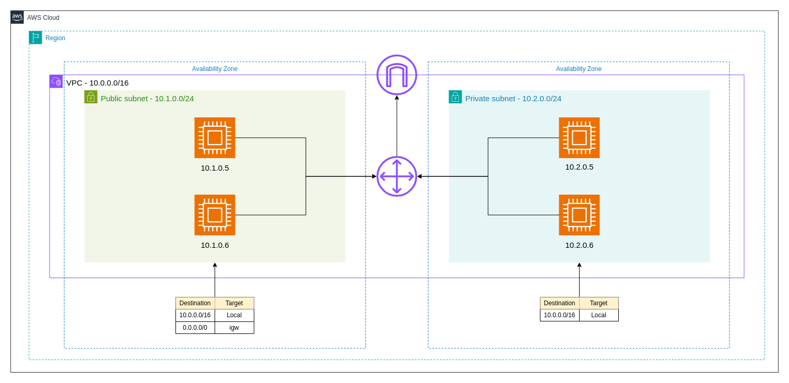

# AWS VPC Network Architecture

A Virtual Private Cloud (VPC) is one of the core services provided by AWS, allowing you to create a private, isolated network within the AWS cloud. Think of a VPC as your own virtual data center within AWS, where you have complete control over the resources and networking components. AWS resources like EC2 instances, RDS databases, and other services are hosted within this VPC, and you can manage how data flows in and out of it.

Creating a VPC might sound complex, but AWS simplifies the process with the Launch VPC Wizard, which provides a visual guide to help you set up your network configuration.

## Key Concepts of VPC

1. **Classless Inter-Domain Routing (CIDR) Blocks**: When you create a VPC, you allocate a range of IP addresses to it using CIDR notation. For example, the range `10.0.0.0/16` gives you 65,535 IP addresses, from `10.0.0.0` to `10.0.255.255`, to use for your resources.

2. **Subnets**: Subnets are smaller segments of the VPC’s CIDR block. They allow you to partition your network for different services, such as a frontend subnet for web access, a backend subnet for business logic, and a database subnet. Subnets help you separate and secure resources based on their access needs—public subnets for resources that need internet access and private subnets for those that don’t.

3. **Route Tables**: These are sets of rules that dictate where network traffic should go. Every subnet has a route table, but you can create custom route tables for better security and control.

4. **Internet Gateway (IGW)**: An IGW provides internet connectivity to your VPC. To allow public internet access, an IGW must be attached to the public subnet’s route table.

5. **Network Address Translation (NAT) Gateways**: A NAT gateway allows instances in private subnets to access the internet for updates and patches while keeping them shielded from inbound internet traffic.

6. **Security Groups (SGs)**: SGs act as virtual firewalls for your instances, controlling inbound and outbound traffic. They only allow traffic that you explicitly permit, following the principle of least privilege.

7. **Network Access Control Lists (NACLs)**: NACLs are another layer of security that controls traffic at the subnet level. Unlike SGs, NACLs are stateless, meaning you must create rules for both inbound and outbound traffic.

8. **Egress-Only Internet Gateways (IGWs)**: These are used for IPv6 traffic, allowing outbound communication from your VPC to the internet while blocking inbound connections.

9. **DHCP Option Sets**: These define network settings like DNS servers and domain names that EC2 instances use when they launch.

10. **VPC Flow Logs**: Flow logs enable you to monitor traffic flow within your VPC, capturing details about accepted and rejected traffic for security and troubleshooting purposes.

To access servers in a private subnet, you can use a bastion host, which serves as a secure entry point. Bastion hosts should be hardened with strong security measures, such as public-key cryptography, to ensure that only authorized users can access them.

A VPC resides within a single AWS Region but can span multiple Availability Zones (AZs). You can create subnets within these AZs, hosting resources like EC2 and RDS instances. The VPC’s route tables manage traffic flow, and by default, all subnets within a VPC can communicate with each other. However, you can customize routing to add additional layers of security, such as virtual firewalls or intrusion detection systems.

AWS offers multiple layers of security and configuration options to protect your infrastructure. Organizations often create multiple VPCs to isolate different environments, but this can complicate communication between VPCs. AWS Transit Gateway (TGW) helps simplify this by providing a central hub for VPC communication.

With these tools and concepts, you can build a robust, secure, and scalable network within AWS.
