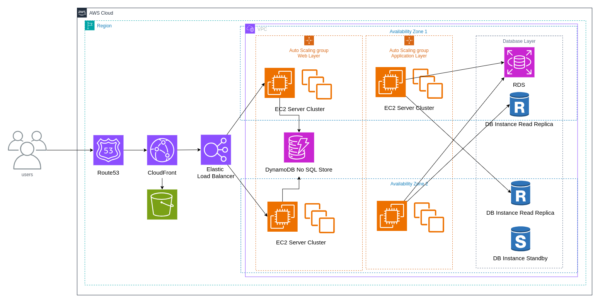

# Stateless and stateful architecture design

When designing a complex application like an e-commerce website, managing user activity across different devices is crucial. For instance, a user might add items to their cart on a mobile phone and then complete the purchase on a laptop. To handle such scenarios efficiently, your application needs to maintain user state until the transaction is complete, even as users switch devices.

To achieve this, it's important to use a stateless approach to user session management. Traditionally, stateful applications store user session information on the server, which makes scaling and maintaining the application more challenging. In stateful systems, once a user is connected to a server, they need to stay connected to that same server for the duration of their session. This approach doesn’t scale well when handling large numbers of users and can lead to performance issues and complications with load balancing.

On the other hand, a stateless architecture, where session information is stored in a persistent database like Amazon DynamoDB, simplifies scaling and improves performance. By using client-side storage, such as cookies, for session IDs, you can ensure that user state is consistently maintained across different servers and devices without the need for sticky sessions. This approach supports horizontal scaling, as it allows your application to handle a growing user base more efficiently and reduces server memory usage.

In a stateless design, user sessions are managed in a NoSQL database, making it easier to distribute user requests across multiple servers without losing session data. This setup also eliminates session timeout issues and reduces the overhead associated with managing sessions on the server side.

To build scalable and efficient applications, consider using a microservices approach with REST design patterns and deploying your services in containers. Implement robust authentication and authorization mechanisms to connect users to your services securely. While managing a centralized data store requires careful consideration to avoid performance bottlenecks, the benefits of a stateless architecture, including better scalability and performance, make it a compelling choice for modern applications.
