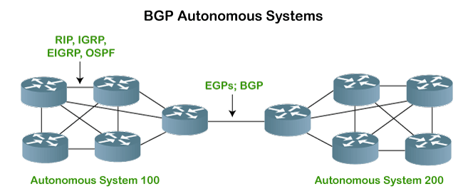

# Border Gateway Protocol (BGP)

The Border Gateway Protocol (BGP) is a standard dynamic network routing protocol used for loop-free interdomain routing between different autonomous systems (ASs). In simpler terms, BGP helps manage how packets are routed across the internet through various networks managed by different organizations, known as autonomous systems. BGP is unique in that it is the only actively used Exterior Gateway Protocol (EGP) on the internet today.

An autonomous system (AS) is a group of IP networks managed by a single organization that presents a unified routing policy to the internet. BGP operates over TCP port 179 to ensure reliable connections and utilizes TCP's error-correction capabilities. One of the key features of BGP is its ability to allow Internet Service Providers (ISPs) and other organizations to define and express their routing policies effectively. This flexibility is crucial for managing traffic between different networks or ASs.

The primary purpose of BGP is to enable ASs to share information about network routes they control. BGP accomplishes this using route advertisements, also known as Network-Layer Reachability Information (NLRI). An AS is identified by a unique Autonomous System Number (ASN), which is assigned by a regional internet registry. These ASNs are used to distinguish different organizations or networks.

BGP is often described as a path-vector routing protocol because it provides information on the path to remote network prefixes. When BGP shares a route, it essentially makes a "promise" that it knows the best way to reach a particular destination network.

## BGP offers several advantages

1. **Control Over Routing:** BGP provides more control over how your network interacts with the broader internet. For example, you can adjust your routing to manage traffic flows or handle network emergencies.
2. **Route Advertisement and Traffic Management:** By advertising certain routes, you can influence how incoming traffic flows into your network. The most specific route usually takes precedence, so precise route advertisements can help direct traffic efficiently.
3. **High Availability and Redundancy:** BGP supports peering with multiple ASs, enhancing network redundancy and reliability. This capability is especially useful for businesses needing highly available internet connectivity.

## BGP can be categorized into two types

1. **Internal BGP (iBGP):** Used for routing within the same autonomous system. iBGP is commonly used to exchange routing information between routers within the same AS.
2. **External BGP (eBGP):** Used for routing between different autonomous systems. eBGP peers are typically directly connected, and the protocol facilitates the exchange of routing information between different ASs.

BGP peers, or neighbors, must be manually configured on each router to establish a connection. Once a peering session is set up, BGP speakers (routers running BGP) exchange routing information. The protocol relies on TCP to ensure reliable delivery of updates, and if a TCP session fails, all associated routes are withdrawn and removed from the routing table.

BGP uses *keepalive* messages to maintain the peering session without needing to resend the entire routing table. This design helps maintain stability and efficiency in large networks.

There are several ways to advertise routes in BGP:

1. **Network Statements:** This method involves using network commands to specify which networks are advertised by a router. For a network to be advertised, it must already be present in the router's IP routing table.
2. **Redistribution of Routes:** BGP can redistribute routes from other routing protocols, such as OSPF (Open Shortest Path First) or static routes. This process involves configuring redistribution commands to ensure that routes learned from other protocols are advertised via BGP.
3. **Static Routes:** Static routes can also be advertised through BGP by configuring the router to include specific static routes in its advertisements.

Network administrators can use commands like show ip bgp to display BGP routes on a router. This command provides valuable information, such as the status of routes, their origin, and the best path selected by BGP.

BGP allows for fine-tuning of network paths using attributes like local preference and weight, giving network operators the ability to control inbound and outbound traffic flow effectively. However, it's important to remember that BGP does not guarantee symmetrical routing paths; incoming and outgoing traffic can take different paths, leading to asymmetric routing.
